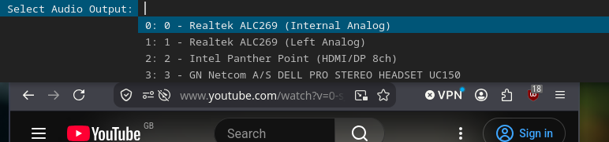

# FreeBSD Audio Switcher

A lightweight, dynamic audio output switcher for **FreeBSD** desktop environments running **i3wm** (or any menu-driven window manager).

It dynamically parses active PulseAudio sound devices, displays them in `dmenu`, updates the default output sink, and automatically moves all live audio streams to the newly selected device.

---

## 📸 Preview



---

## 🌟 Features

* **Dynamic Hardware Detection:** Automatically queries PulseAudio for available audio outputs (`pactl list sinks`).
* **Seamless Live Retargeting:** Automatically moves currently playing audio streams (e.g., Firefox, media players) to the newly selected output without requiring application restarts.
* **Minimal Dependencies:** Built with standard FreeBSD utilities, `dmenu`, and POSIX shell script compliance.
* **i3wm Ready:** Easily bound to an i3 keyboard shortcut for quick menu access.

---

## 📦 Dependencies

Ensure the following packages are installed on your FreeBSD system:

* **PulseAudio** (`pulseaudio` / `pactl`) — Audio server and control utility
* **dmenu** — Dynamic menu launcher for X11
* **libnotify** (`notify-send`) — Desktop notifications (optional)

To install missing dependencies via `pkg`:

```sh
pkg install pulseaudio dmenu libnotify
```

---

## 🚀 Installation & Setup

### 1. Clone the Repository

Clone this repository or place `audio-switch.sh` into your local executable path (e.g., `~/.local/bin/`):

```sh
mkdir -p ~/.local/bin
git clone https://github.com/gamesmessiah/freebsd-audio-switcher.git /tmp/freebsd-audio-switcher
cp /tmp/freebsd-audio-switcher/audio-switch.sh ~/.local/bin/audio-switch.sh
chmod +x ~/.local/bin/audio-switch.sh
```

### 2. Add Keybinding to i3wm

Open your i3 configuration file (`~/.config/i3/config`):

```sh
nano ~/.config/i3/config
```

Add a keybinding (e.g., `$mod+Shift+s` or `$mod+Shift+m`) to execute the script:

```i3config
# FreeBSD Audio Switcher via dmenu
bindsym $mod+Shift+s exec --no-startup-id ~/.local/bin/audio-switch.sh
```

### 3. Reload i3 Configuration

Press `$mod+Shift+r` or execute in terminal:

```sh
i3-msg reload
```

---

## 📖 Usage

1. Press your assigned shortcut (`$mod+Shift+s`).
2. A `dmenu` bar will pop up listing all available audio sinks (Headphones, Speakers, USB Headsets, HDMI, etc.).
3. Select your desired output using the arrow keys or by typing, then press `Enter`.
4. Any active playback streams will instantly migrate to the chosen device!

---

## 📜 Script Code

For reference, the script logic (`audio-switch.sh`):

```sh
#!/bin/sh
# FreeBSD Dynamic Audio Switcher via PulseAudio and dmenu

# Parse available sinks: "sink_id: Description"
SINKS=$(pactl list sinks | awk '
    /^Sink #/ { id=substr($2, 2) }
    /Description:/ { sub(/^[ \t]*Description: /, ""); print id ": " $0 }
')

if [ -z "$SINKS" ]; then
    notify-send "Audio Switcher" "No PulseAudio sinks found."
    exit 1
fi

# Present selection via dmenu
SELECTED=$(echo "$SINKS" | dmenu -i -p "Select Audio Output:" -l 10)

[ -z "$SELECTED" ] && exit 0

# Extract chosen sink ID
SINK_ID=$(echo "$SELECTED" | awk -F':' '{print $1}')

# Set default sink for new streams
pactl set-default-sink "$SINK_ID"

# Move all current audio streams to new sink
pactl list sink-inputs | awk '/^Sink Input #/ {print $3}' | while read -r INPUT_ID; do
    pactl move-sink-input "$INPUT_ID" "$SINK_ID"
done

notify-send "Audio Switcher" "Switched audio output to sink $SINK_ID"
```

---

## 📄 License

This project is licensed under the **DO WHAT THE FUCK YOU WANT TO PUBLIC LICENSE (WTFPL)**. See the [LICENSE](https://github.com/gamesmessiah/freebsd-audio-switcher/blob/main/LICENSE) file or [wtfpl.net](http://www.wtfpl.net) for details.
